# LoRA-Forge Architecture
## 1. Architectural Overview
LoRA-Forge is designed as a high-performance, containerized web application. The architecture separates concerns into five primary services, orchestrated by Docker Compose, to ensure a responsive user experience and scalable backend processing.
 * Frontend: A modern, single-page application (SPA) that runs in the user's browser.
 * Backend: A stateless API server that handles business logic and orchestrates all backend operations.
 * Database (PostgreSQL): A persistent relational database for storing all structured metadata.
 * Task Queue & Cache (Redis): An in-memory data store serving as the message broker for background jobs and as a high-speed cache.
 * Worker: An asynchronous task processor that executes long-running jobs independently of the API.
## 2. Core Principles
 * Stateless Backend: The Python/FastAPI backend does not store any session state between requests. This allows for easier scaling and robustness. State is managed by the frontend and persisted in the database or Redis.
 * Asynchronous by Default: Any operation that could take more than a few seconds (file I/O, model inference, image processing) is offloaded to the background worker via Redis. The API's role is to accept the job and respond immediately.
 * Cache-First Strategy: For frequently accessed or computationally expensive data (like dataset statistics), the backend will attempt to retrieve it from the Redis cache before querying the main PostgreSQL database.
 * Separation of Data and Metadata: Physical image/video files are stored on the file system. The database stores structured metadata about those files, while Redis holds temporary state and cached data.
## 3. System Components Diagram
This diagram illustrates the flow of information between the components, highlighting the central role of Redis.

``` mermaid 
graph TD
    subgraph User's Machine
        Browser[🌐 Browser <br> Frontend SPA - React]
    end

    subgraph Server / Docker Environment
        A[▶️ Backend API <br> Python / FastAPI]
        B[🐘 Database <br> PostgreSQL]
        C[👷‍♂️ Worker <br> Celery]
        D[🗃️ File System <br> /data]
        E[⚡ Task Queue & Cache <br> Redis]
    end

    Browser -- HTTPS API Calls --> A
    A -- Read/Write Metadata --> B
    A -- Enqueues Jobs --> E
    A -- Read/Write Cache --> E
    C -- Dequeues Jobs --> E
    C -- Read/Write Files --> D
    C -- Read/Write Metadata --> B
    A -- Serves File URLs --> Browser
```

## 4. Component Breakdown
### 4.1. Frontend (React / Vite)
 * Purpose: Provides the entire user experience. It is responsible for rendering the photo grid, upload forms, and statistics, as well as communicating with the backend API.
 * Key Responsibilities:
   * Making API calls to the Backend.
   * Displaying real-time progress of background tasks by polling status endpoints or via WebSockets.
   * Managing client-side state.
### 4.2. Backend (Python / FastAPI)
 * Purpose: The brain of the application. It exposes a RESTful API, validates user input, manages the cache, interacts with the database, and delegates long-running tasks to the worker via Redis.
 * Key Responsibilities:
   * Job Production: When a batch operation is requested, it creates a job message and pushes it onto the Redis task queue.
   * Cache Management: Before running an expensive DB query (e.g., for dataset stats), it checks Redis for a cached result. If not found, it runs the query and stores the result in Redis for future requests.
   * API Endpoints: Exposes endpoints like POST /datasets/upload, GET /datasets/{id}/images, POST /images/batch-process, and GET /tasks/{task_id}/status.
### 4.3. Task Queue & Cache (Redis)
 * Purpose: Serves as the high-speed central hub for asynchronous communication and data caching.
 * Key Responsibilities:
   * As a Task Queue (Message Broker): Manages a list (or queue) of jobs to be processed. It decouples the Backend API from the Worker, ensuring the API can accept new requests without waiting for previous ones to finish.
   * As a Caching Layer: Stores frequently accessed data in-memory with a Time-To-Live (TTL). This dramatically reduces latency and load on the PostgreSQL database for repeated requests.
### 4.4. Worker (Celery)
 * Purpose: To execute jobs asynchronously so the API can respond instantly. It is a separate process that runs independently of the web server.
 * Key Responsibilities:
   * Job Consumption: Continuously monitors the Redis task queue for new jobs.
   * Heavy Lifting: Performs the actual long-running tasks (image processing, analysis, captioning, etc.).
   * Database Updates: Updates the PostgreSQL database with the results of its work (e.g., saving generated captions, updating image metadata).
### 4.5. Database (PostgreSQL)
 * Purpose: The single source of truth for all persistent, structured data.
 * High-Level Schema:
   * datasets: Stores information about each dataset (id, name, source_path, created_at).
   * images: Core table for every image file (id, dataset_id, filename, path, width, height).
   * image_metadata: A flexible table for storing analysis results (image_id, metadata_key, metadata_value).
   * captions: Stores generated captions (image_id, caption_text, model_used).
   * background_tasks: Tracks the status of jobs (id, status, progress, result).
## 5. Data Flow Example: Batch Captioning
 * User Action: User selects 100 images in the frontend and clicks "Batch Caption".
 * Frontend: Sends a POST request to /images/batch-process with a payload containing the operation type and image IDs.
 * Backend API:
   * Receives and validates the request.
   * Creates a new record in the background_tasks table in PostgreSQL.
   * Pushes a job message onto the 'tasks' list in Redis. The message contains the task type and image IDs.
   * Immediately returns a 202 Accepted response to the Frontend with the unique task_id.
 * Frontend: Receives the task_id and begins polling the GET /tasks/{task_id}/status endpoint to show progress.
 * Worker:
   * Is constantly monitoring the 'tasks' list in Redis. It pulls the new captioning job from the queue.
   * Updates the task status to RUNNING in the PostgreSQL database.
   * For each image, it performs the captioning and saves the result to the captions table in PostgreSQL.
   * After completing all images, it updates the task's final status to COMPLETED.
 * Frontend: The next poll to the status endpoint returns COMPLETED, and the UI updates to show the task is done, refreshing the view to display the new captions.
## 6. On-Disk File System Layout
All media and temporary files are stored in a Docker volume mounted at /data to ensure data persistence across container restarts.
``` plaintext
/data/
├── datasets/
│   ├── {dataset_id_1}/
│   │   ├── originals/
│   │   │   ├── image01.jpg
│   │   ├── processed/
│   │   │   └── image01_face_0.png
│   │   └── exports/
│   │       └── training_data_v1.zip
│   └── {dataset_id_2}/
└── uploads/
    └── temp_archive.zip
```
