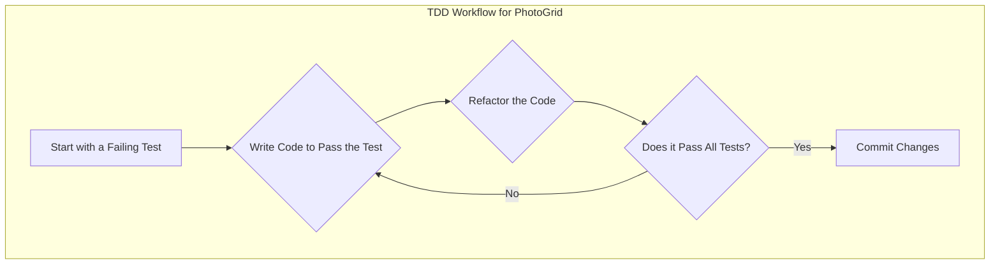
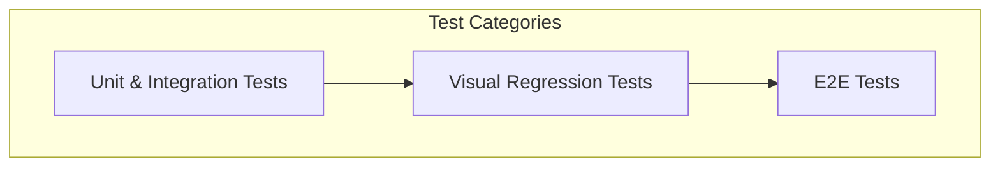

# Testing Plan: PhotoGrid Component

This document outlines the testing strategy for the new features of the `PhotoGrid` component, which will be implemented using a Test-Driven Development (TDD) approach.

### Development Approach

We will use `@mui/lab/Masonry` for the layout and the native `loading="lazy"` attribute for lazy loading images.

### TDD Workflow

The development process will follow this cycle:

1.  **Write a Failing Test:** Create a new test case that captures a specific requirement. This test will initially fail because the feature is not yet implemented.
2.  **Write Code to Pass:** Implement the minimum amount of code required to make the failing test pass.
3.  **Refactor:** Improve the code's structure and readability without changing its behavior.
4.  **Repeat:** Continue the cycle for all new features.



### Test Cases

#### 1. Aspect Ratio and Layout Testing (using `@mui/lab/Masonry`)

*   **Test 1.1: `Masonry` component is used for the layout.**
    *   **Objective:** Verify that the `Grid` component is replaced with the `Masonry` component.
    *   **Method:** Check for the presence of the `Masonry` component in the rendered output.
*   **Test 1.2: Images with different aspect ratios are rendered.**
    *   **Objective:** Ensure that photos with varying dimensions are passed to the `PhotoThumbnail` component.
    *   **Method:** Create mock photo data with different `width` and `height` properties and verify they are rendered.
*   **Test 1.3: The number of columns is responsive.**
    *   **Objective:** The `Masonry` component should adjust the number of columns based on the screen size.
    *   **Method:** Check that the `responsive` prop or equivalent is passed to the `Masonry` component. A full E2E or visual regression test is recommended for comprehensive validation.

#### 2. Lazy Loading Testing

*   **Test 2.1: `loading="lazy"` attribute is present on images.**
    *   **Objective:** Confirm that the `` elements within the `PhotoThumbnail` components have the `loading="lazy"` attribute.
    *   **Method:** Render the `PhotoGrid` with mock photos and inspect the rendered `` elements to ensure the attribute is present.

#### 3. Existing Functionality (Regression Testing)

*   **Test 3.1: Loading state is handled correctly.**
    *   **Objective:** Ensure the "Loading photos..." message is displayed.
*   **Test 3.2: Error state is handled correctly.**
    *   **Objective:** Ensure the error message is displayed.
*   **Test 3.3: Empty state is handled correctly.**
    *   **Objective:** Ensure the "No photos to display" message is shown.

### Testing Levels



*   **Unit & Integration Tests:** The tests outlined above will be implemented using Vitest and React Testing Library.
*   **Visual Regression Tests:** Recommended for verifying the `Masonry` layout's responsiveness and visual correctness across different breakpoints.
*   **E2E Tests:** Can be used to simulate user interactions and verify the lazy loading functionality in a real browser environment.

### Dockerized Testing

To ensure consistency across environments, tests should be run within Docker containers.

1.  **Build/Rebuild Docker Images:**
    ```bash
    docker-compose build
    ```

2.  **Run Frontend Tests:**
    ```bash
    docker-compose run --rm frontend npm test
    ```