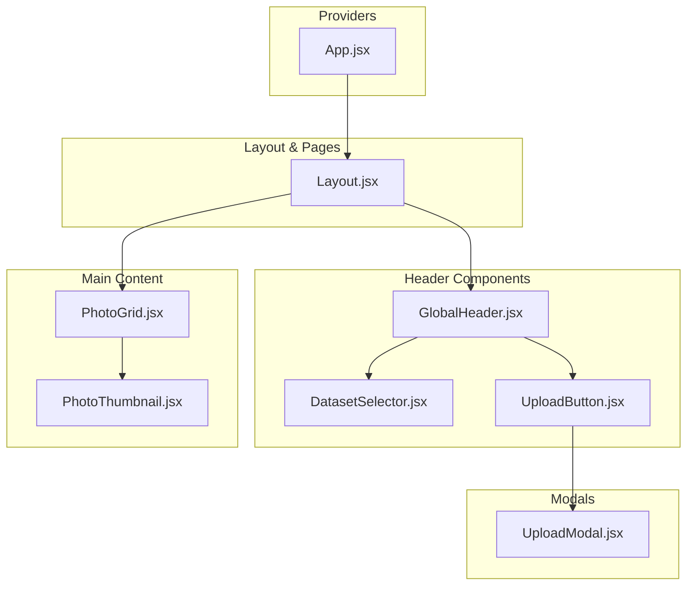
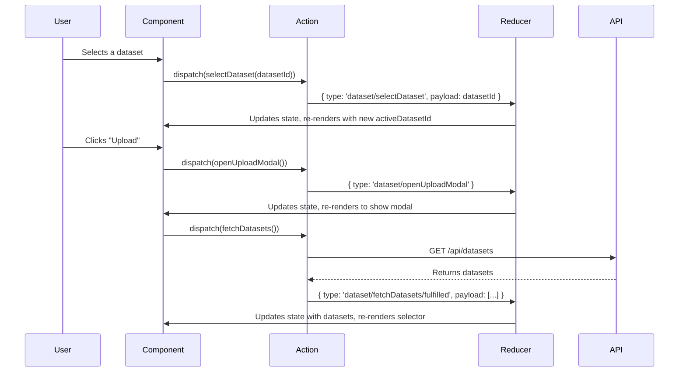

# Technical Plan: Frontend UI Upgrade

This document outlines the technical plan for a significant UI upgrade of the LoRAForge frontend. The goal is to create a modern, responsive, and maintainable application structure.

## 1. Component Structure

We will refactor the UI into a clear, hierarchical component structure. The `App.jsx` will be simplified to act as a router and provider, while a new `Layout` component will manage the main application view.

### Component Hierarchy Diagram



### Component Details

*   **`App.jsx`**
    *   **Purpose:** The root component. It will set up the Redux Provider, MUI Theme Provider, and any routing.
    *   **Props:** None.

*   **`Layout.jsx`**
    *   **Purpose:** The main container for the application's visual structure. It will render the `GlobalHeader` and the main content area where the `PhotoGrid` will be displayed.
    *   **Props:** None.

*   **`GlobalHeader.jsx`**
    *   **Purpose:** A persistent header at the top of the page. It will contain the application title, the `DatasetSelector`, and the `UploadButton`.
    *   **Props:** None.

*   **`DatasetSelector.jsx` (Refactor)**
    *   **Purpose:** A dropdown to display and select from a list of available datasets. It will be a "dumb" component that gets its data and actions from props.
    *   **Props:**
        *   `datasets: Array` - List of dataset objects (`{ id, name }`).
        *   `activeDatasetId: string | null` - The ID of the currently selected dataset.
        *   `onSelectDataset: (id: string) => void` - Callback function to dispatch the selection action.
        *   `isLoading: boolean` - To show a loading state.

*   **`UploadButton.jsx`**
    *   **Purpose:** A simple button that triggers the upload modal.
    *   **Props:**
        *   `onClick: () => void` - Callback to open the modal.

*   **`UploadModal.jsx`**
    *   **Purpose:** A modal/dialog for file uploads. It will contain the upload logic and UI.
    *   **Props:**
        *   `isOpen: boolean` - Controls the visibility of the modal.
        *   `onClose: () => void` - Callback to close the modal.
        *   `onUpload: (files: File[]) => void` - Callback to handle the file upload logic.

*   **`PhotoGrid.jsx` (Refactor)**
    *   **Purpose:** A responsive, grid-based gallery to display photos from the selected dataset.
    *   **Props:**
        *   `photos: Array` - List of photo objects (`{ id, filename, url }`).
        *   `isLoading: boolean` - To show a loading state while photos are being fetched.
        *   `error: string | null` - To display an error message if fetching fails.

*   **`PhotoThumbnail.jsx`**
    *   **Purpose:** Renders a single image thumbnail within the `PhotoGrid`.
    *   **Props:**
        *   `photo: { id, filename, url }` - The photo object to render.

## 2. State Management (Redux)

We will enhance the `datasetSlice` to be the single source of truth for datasets, photos, and UI state related to them. We'll use Redux Toolkit's `createAsyncThunk` to handle asynchronous API calls gracefully.

### Redux State Shape

```json
{
  "dataset": {
    "datasets": [],
    "photos": [],
    "activeDatasetId": null,
    "isUploadModalOpen": false,
    "status": "idle",
    "error": null
  }
}
```

### Redux Data Flow Diagram



### Actions and Reducers (`datasetSlice.js`)

*   **`fetchDatasets` (Async Thunk):**
    *   **Action:** Makes a `GET` request to `/api/datasets`.
    *   **Reducers:**
        *   `pending`: Sets `status` to `'loading'`.
        *   `fulfilled`: Populates `state.datasets` with the response and sets `status` to `'succeeded'`. If `activeDatasetId` is null, it sets the first dataset as active.
        *   `rejected`: Sets `status` to `'failed'` and stores the error message.

*   **`fetchPhotosForDataset` (Async Thunk):**
    *   **Action:** Takes a `datasetId` and makes a `GET` request to `/api/datasets/{id}/images`.
    *   **Reducers:**
        *   `pending`: Sets `status` to `'loading'`.
        *   `fulfilled`: Populates `state.photos` with the image list.
        *   `rejected`: Sets `status` to `'failed'`, clears `state.photos`, and stores the error.

*   **`uploadDataset` (Async Thunk):**
    *   **Action:** Takes files and makes a `POST` request to `/api/datasets/upload`.
    *   **Reducers:**
        *   `fulfilled`: Closes the modal and triggers `fetchDatasets` to refresh the list.

*   **Standard Reducers:**
    *   `selectDataset(state, action)`: Sets `state.activeDatasetId = action.payload`.
    *   `openUploadModal(state)`: Sets `state.isUploadModalOpen = true`.
    *   `closeUploadModal(state)`: Sets `state.isUploadModalOpen = false`.

## 3. API Interaction

The frontend will interact with the following RESTful API endpoints provided by the FastAPI backend.

*   `GET /api/datasets`
    *   **Description:** Fetches a list of all available datasets.
    *   **Response Body:** `[{ "id": "uuid", "name": "string" }, ...]`
*   `GET /api/datasets/{id}/images`
    *   **Description:** Fetches a list of all images within a specific dataset.
    *   **Response Body:** `[{ "id": "uuid", "filename": "string", "url": "/api/images/{id}/file" }, ...]`
*   `POST /api/datasets/upload`
    *   **Description:** Uploads a new dataset (e.g., a `.zip` file). The backend will process this asynchronously.
    *   **Request Body:** `FormData` containing the file(s).
    *   **Response Body:** A task ID for polling progress (`{ "task_id": "uuid" }`).

## 4. Styling and Animation

*   **Styling:** We will continue to use **MUI** for core components (`Button`, `Select`, `Modal`, `Grid`) and **Emotion** (`@emotion/styled`) for creating custom, reusable styled components like `GlobalHeader` and `PhotoGrid`. This ensures a consistent design system and scoped styles.

*   **Animation:** We will leverage **`framer-motion`** to add subtle, meaningful animations that improve the user experience.
    *   **Upload Modal:** The modal will fade in and scale up when opened, using `<motion.div>` with `initial`, `animate`, and `exit` props.
    *   **Photo Grid:** Each `PhotoThumbnail` will stagger-fade in as the grid loads, using the `staggerChildren` variant feature of `framer-motion`. This will create a pleasant loading effect instead of images just popping in.